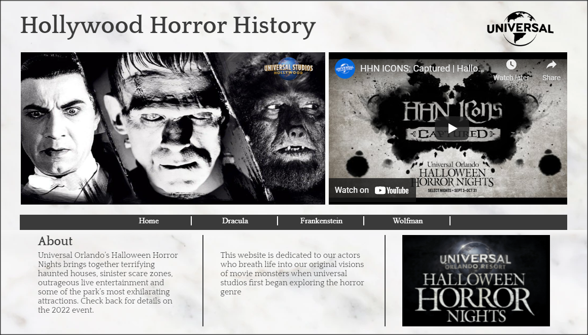
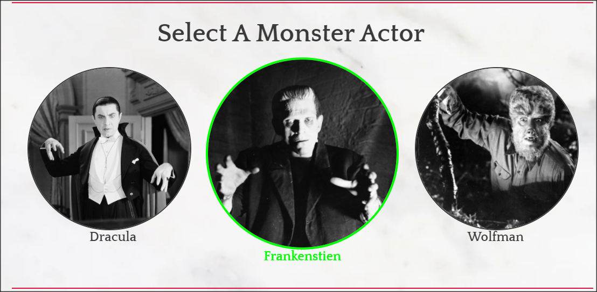
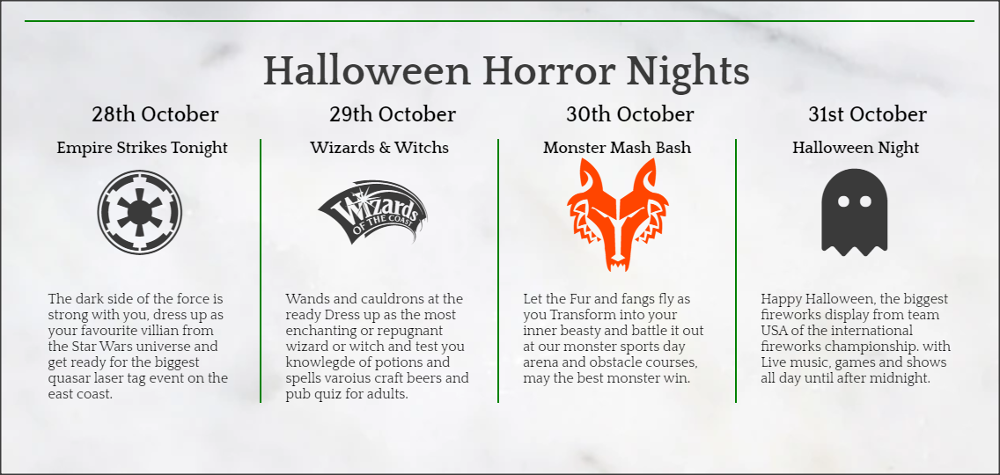
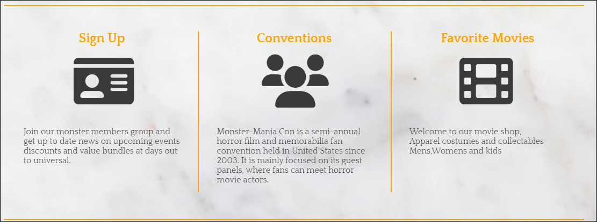
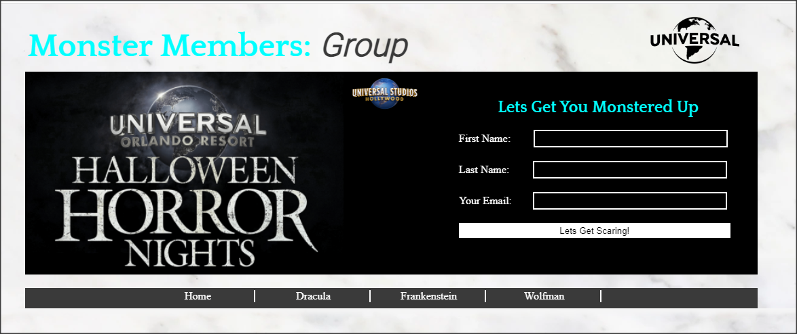
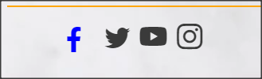
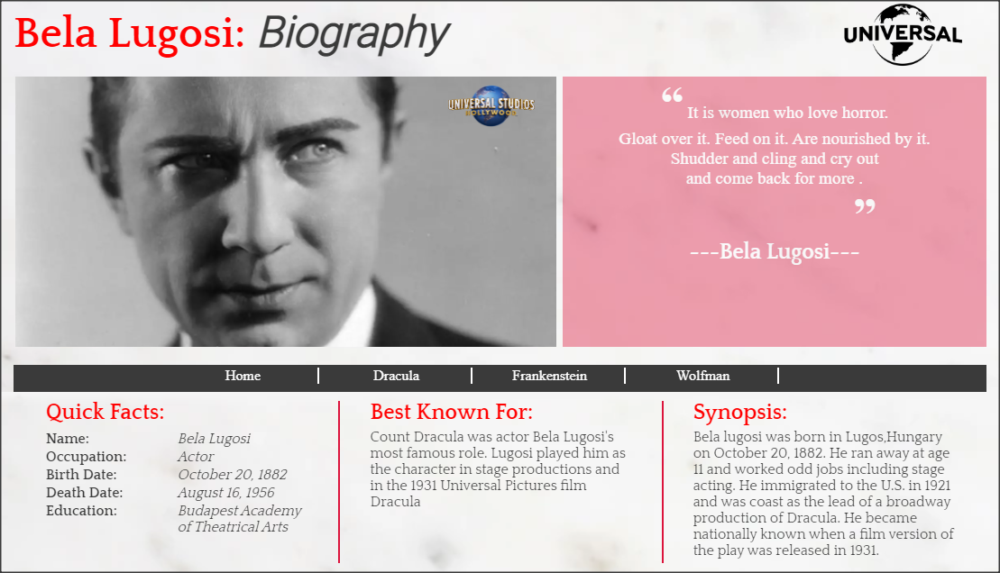
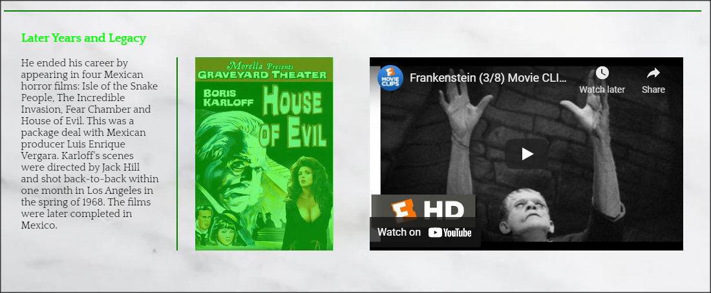

# Hollywood Horror History #

Hollywood Horror History website celebrates the historical movie monsters of the
silver screen as its main objective is to give biographical knowledge of the actors
behind the make-up. this site ties into the Universal movie studio that gave birth to
bringing the visual concepts of these creatures to the screen, aswell as acting as a
homage to a real life event that takes place at universal studios the yearly 'Halloween horror Nights'.
this website displays an ability to be used in a real world context.

## Features ##

### The Header ###
* Displays the title, a hero image of each actor and a quote from the actor 
* Alongside the header content are two logos from universal consistantly positioned through the pages
* Each pages title and quote background is colour coded to represent each monster/actor

### Navigation changes colour ###
* Featured under the hero image it displays the four main pages of the site
* The home page and the three monster pages which change into the colour of their asscociated monster     
  when hovered over

### Monster Buttons ###
* Three circle buttons containing an image of the actors in monster form
* Dynamic hover interaction makes the buttons pop up and change colour
* When clicked these act as additonal links to each page on the site

### Horror Nights Events ###
* All pages contain the four themed costume events guide 
* Dynamic icons representing each night pop out and change colour 
* Useful information as to what each days activity intails

### Sign up, communites, merchandise ###
* There is a sign up link that leads to the websites form to become a member
* Community groups, get together and conventions (to be added at a later date).
* Merchandise section (to be added at a later date).

### Social links ###
All four links pop and change into their brand colour 
* facebook
* instagram
* twitter
* youtube

### Actor content ###
* Three sections of information relating to the diffrent stages of each actor during there life.
* Those are the early years, their time playing the iconic character and later life endevours.
* Integrated into each third section a video of the actors in action on the silver screen.

## Testing ##

## Bugs ##
Solved bugs

Bug 1
* I discovered that when I deployed my site through git hub the file paths did not work
  for the CSS and images

Solution
* Using dev tools I figured out that i had used absolute file paths /assets the forward slash
  before the assets file was the problem.

Bug 2
* Some how my branches Diverged just at the end causing problems with pushing to git hub

Solution
* I was able to eventually merge the branches to get the project back on track

### Validator testing ###
* HTML
* CSS
* Accessibility

### Unfixed Bugs ###

### Credits ###
* The code for social media links was taken from the love running project.

### Media ###
* The images to make this site were taken from: