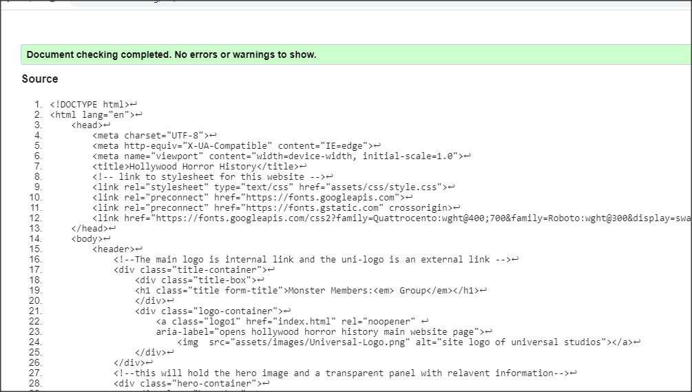
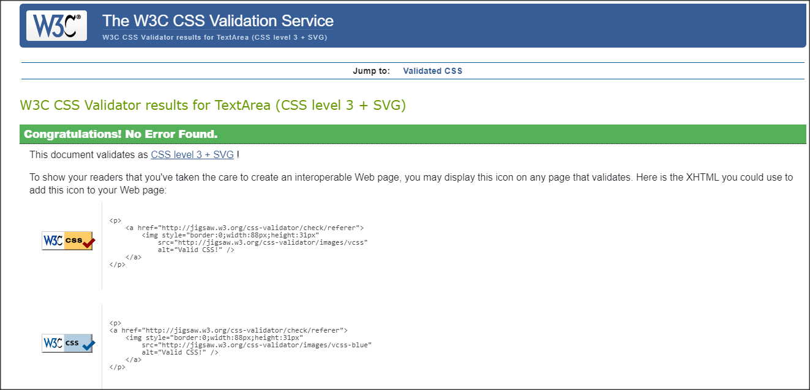
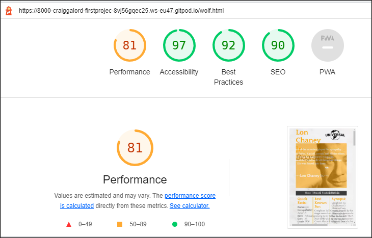
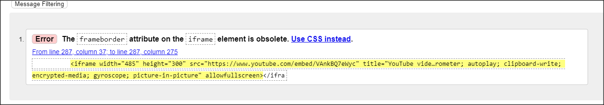

# Hollywood Horror History #

Hollywood Horror History website celebrates the historical movie monsters of the
silver screen as its main objective is to give biographical knowledge of the actors
behind the make-up. this site ties into the Universal movie studio that gave birth to
bringing the visual concepts of these creatures to the screen, aswell as acting as a
homage to a real life event that takes place at universal studios the yearly 'Halloween horror Nights'.
this website displays an ability to be used in a real world context.

## Features ##

### The Header ###
* Displays the title, a hero image of each actor and a quote from the actor 
* Alongside the header content are two logos from universal consistantly positioned through the pages
* Each pages title and quote background is colour coded to represent each monster/actor

### Navigation changes colour ###
* Featured under the hero image it displays the four main pages of the site
* The home page and the three monster pages which change into the colour of their asscociated monster     
  when hovered over

### Monster Buttons ###
* Three circle buttons containing an image of the actors in monster form
* Dynamic hover interaction makes the buttons pop up and change colour
* When clicked these act as additonal links to each page on the site

### Horror Nights Events ###
* All pages contain the four themed costume events guide 
* Dynamic icons representing each night pop out and change colour 
* Useful information as to what each days activity intails

### Sign up, communites, merchandise ###
* There is a sign up link that leads to the websites form to become a member
* Community groups, get together and conventions (to be added at a later date).
* Merchandise section (to be added at a later date).

### Social links ###
All four links pop and change into their brand colour 
* facebook
* instagram
* twitter
* youtube

### Actor content ###
* Three sections of information relating to the diffrent stages of each actor during there life.
* Those are the early years, their time playing the iconic character and later life endevours.
* Integrated into each third section a video of the actors in action on the silver screen.

## Testing ##

## Bugs ##
Solved bugs

Bug 1
* I discovered that when I deployed my site through git hub the file paths did not work
  for the CSS and images

Solution
* Using dev tools I figured out that i had used absolute file paths /assets the forward slash
  before the assets file was the problem.

Bug 2
* Some how my branches Diverged just at the end causing problems with pushing to git hub

Solution
* I was able to eventually merge the branches to get the project back on track

### Validator testing ###
* HTML

* CSS
  
* Accessibility

### Unfixed Bugs ###

* there was just one Bug in the end implementing videos in an outdated 
  fashion.
### Credits ###
* The code for social media links was taken from the love running project.

### Media ###
* The images to make this site were taken from:

index
https://sportshub.cbsistatic.com/i/2021/08/04/e410f4f8-7066-4c30-8817-9a517daa618e/universal-classic-monsters-1277618.jpg

horror nights
https://www.google.com/search?q=halloween+horror+night+universal&tbm=isch&ved=2ahUKEwiLguOO-pn2AhVFqaQKHZUlBkEQ2-cCegQIABAA&oq=halloween+night+un&gs_lcp=CgNpbWcQARgAMgYIABAIEB4yBAgAEBg6BwgjEO8DECc6CggjEO8DEOoCECc6CAgAELEDEIMBOggIABCABBCxAzoFCAAQgAQ6BAgAEEM6BwgAELEDEENQhgpYrGNgy3RoBXAAeACAAU-IAdMJkgECMjOYAQCgAQGqAQtnd3Mtd2l6LWltZ7ABCsABAQ&sclient=img&ei=kFIYYov6K8XSkgWVy5iIBA&bih=657&biw=1366#imgrc=E_iP5Nc6F8Bd5M&imgdii=qUtvAhupVoGKYM

https://www.coaster101.com/wp-content/uploads/2020/07/hhn-logo-Large.png

dracula
https://m.media-amazon.com/images/M/MV5BMTAxNDIyMjgzOTNeQTJeQWpwZ15BbWU3MDU5MDg0Mjc@._V1_.jpg

dracula-sketch
https://i0.wp.com/bloody-disgusting.com/wp-content/uploads/2020/08/Dracula_Cover-scaled.jpg?ssl=1

dracula-victim

https://chud.com/wp-content/uploads/2012/01/Bela-Lugosis-Dracula-cape-up-for-auction.png

bela-header
https://www.mentalfloss.com/article/84310/12-surprising-facts-about-bela-lugosi

frank-sketch
https://cdnb.artstation.com/p/assets/images/images/016/178/175/large/frederick-cooper-boris-frankenstein-2-25-2019-small.jpg?1551206432

borris-header
https://en.wikipedia.org/wiki/Boris_Karloff#/media/File:Boris_Karloff.jpg

frank-icon
https://m.media-amazon.com/images/M/MV5BMTAzMzkzNDIwODReQTJeQWpwZ15BbWU4MDc4NjY3OTEx._V1_.jpg

chaney-header
https://www.filmsinreview.com/post/repairing-lon-chaney-jr-s-legacy

smug-chaney
https://www.filmsinreview.com/post/repairing-lon-chaney-jr-s-legacy

wolf-icon
https://m.media-amazon.com/images/M/MV5BMTk3MzQ2MjQzMF5BMl5BanBnXkFtZTgwMzI3NjQ3MTE@._V1_.jpg

stand-in-logo
https://www.google.com/search?q=bat+logo&tbm=isch&ved=2ahUKEwiW7sGO-In2AhXQbMAKHSyYBosQ2-cCegQIABAA&oq=bat+logo&gs_lcp=CgNpbWcQAzIECAAQQzIECAAQQzIFCAAQgAQyBQgAEIAEMgUIABCABDIFCAAQgAQyBQgAEIAEMgUIABCABDIFCAAQgAQyBQgAEIAEOgcIIxDvAxAnOgcIABCxAxBDOgsIABCABBCxAxCDAVCtuwFYhsMBYKLMAWgBcAB4AIABUYgB2AKSAQE2mAEAoAEBqgELZ3dzLXdpei1pbWfAAQE&sclient=img&ei=--wPYtaEHtDZgQassJrYCA&bih=600&biw=1366#imgrc=Yb1j5W_VX1Ez3M&imgdii=TaSBb7_Chsr0wM

universal-vector-logo
https://www.google.com/search?q=universal+studios+logo&tbm=isch&ved=2ahUKEwjurOiC8Yn2AhUK3OAKHamMABsQ2-cCegQIABAA&oq=universal+studios+lo&gs_lcp=CgNpbWcQARgAMgUIABCABDIFCAAQgAQyBQgAEIAEMgUIABCABDIFCAAQgAQyBQgAEIAEMgUIABCABDIFCAAQgAQyBQgAEIAEMgUIABCABDoHCCMQ7wMQJzoGCAAQBRAeOgYIABAIEB46BggAEAcQHjoECAAQGDoGCAAQChAYOgoIIxDvAxDqAhAnOgQIABBDOggIABCABBCxAzoICAAQsQMQgwE6CwgAEIAEELEDEIMBOgcIABCxAxBDOgoIABCxAxCDARBDULkEWJX5c2Cli3RoAXAAeACAAbQBiAGPEJIBBDM1LjGYAQCgAQGqAQtnd3Mtd2l6LWltZ7ABCsABAQ&sclient=img&ei=i-UPYq67N4q4gwepmYLYAQ&bih=600&biw=1366#imgrc=QWIY245dzc0bKM

universal-header-logo
https://www.google.com/search?q=universal+studios+logo&tbm=isch&ved=2ahUKEwjurOiC8Yn2AhUK3OAKHamMABsQ2-cCegQIABAA&oq=universal+studios+lo&gs_lcp=CgNpbWcQARgAMgUIABCABDIFCAAQgAQyBQgAEIAEMgUIABCABDIFCAAQgAQyBQgAEIAEMgUIABCABDIFCAAQgAQyBQgAEIAEMgUIABCABDoHCCMQ7wMQJzoGCAAQBRAeOgYIABAIEB46BggAEAcQHjoECAAQGDoGCAAQChAYOgoIIxDvAxDqAhAnOgQIABBDOggIABCABBCxAzoICAAQsQMQgwE6CwgAEIAEELEDEIMBOgcIABCxAxBDOgoIABCxAxCDARBDULkEWJX5c2Cli3RoAXAAeACAAbQBiAGPEJIBBDM1LjGYAQCgAQGqAQtnd3Mtd2l6LWltZ7ABCsABAQ&sclient=img&ei=i-UPYq67N4q4gwepmYLYAQ&bih=600&biw=1366#imgrc=jusLUlO36hM9HM

hollywood-monsters
https://pics.filmaffinity.com/Hollywood_Monsters-794634208-large.jpg

font awsome icons
empire
https://fontawesome.com/icons/empire?s=brands

Content text
lon chaney jr.
https://en.wikipedia.org/wiki/Lon_Chaney_Jr.

https://en.wikipedia.org/wiki/The_Wolf_Man_(1941_film)

chaney-pic3
https://en.wikipedia.org/wiki/Spider_Baby#/media/File:Spiderbabyposter.jpg

quote
https://www.azquotes.com/quote/881359

Borris karloff
https://en.wikipedia.org/wiki/Boris_Karloff

boris-pic1
https://pbs.twimg.com/media/FCvrsSCXEAUGoDw.png

boris-pic2
https://www.considerable.com/entertainment/retronaut/boris-karloff-frankenstein/

boris-pic3

quote
https://www.azquotes.com/quote/738641

Bela lugosi
https://en.wikipedia.org/wiki/Bela_Lugosi

bela-pic1
https://upload.wikimedia.org/wikipedia/commons/5/53/Lugosi_B%C3%A9la_fortepan_14652.jpg

bela-pic3
https://c8.alamy.com/comp/E5N3P8/plan-9-from-outer-space-1959-E5N3P8.jpg

qoute
https://www.brainyquote.com/quotes/bela_lugosi_315084

video of dracula
https://www.youtube.com/watch?v=IVPxAgy7lBA
